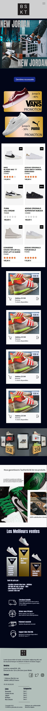

##BSKT

Dans le cadre de la formaiton Access Code School nous avons eu un exercice de création de site de e-commerce sur un object au choix.
J'ai personnnellement choisi de faire un site de e-commerce pour des Sneaker pour homme.

Vous trouverez dans ce Git, 
- le template 
- le logo
- le début d'une intégration 

Notez que ce projet n'est pas tout à fait terminé mais il le sera bientôt ;) stay tuned 

#Preview

